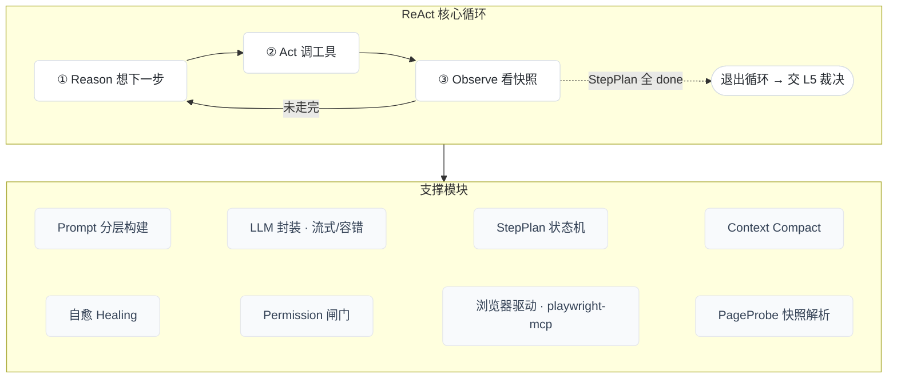
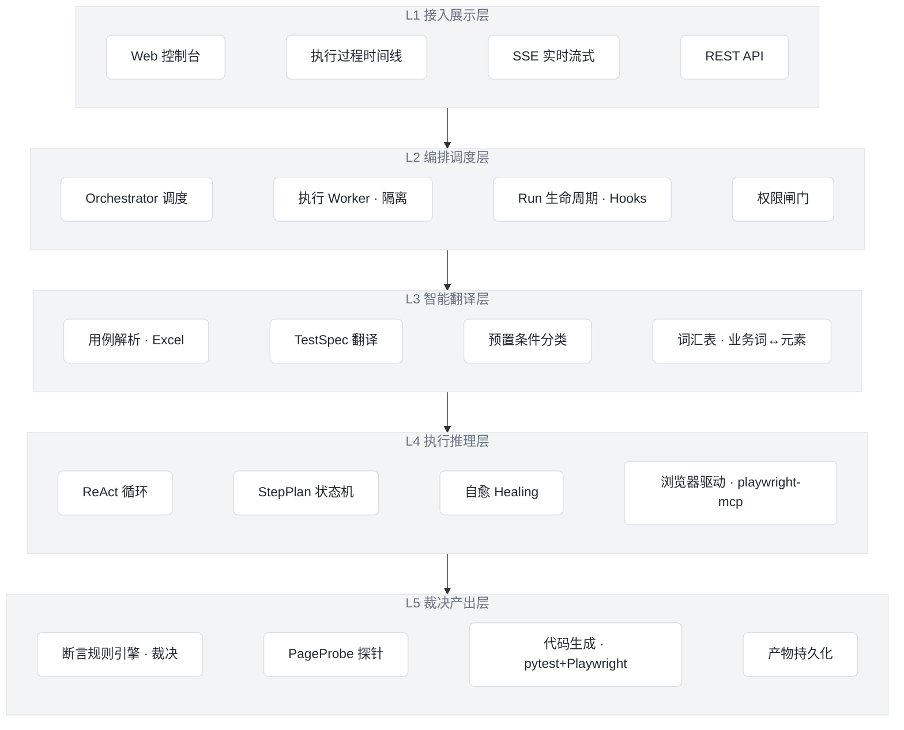

两件事:① L4 放大长啥样 ② 一份能照着念的口播稿。

---

## 一、L4 拆细(执行推理层放大图)

L4 是整个系统最"重"的一层,也是最该单独放一页讲的。它的核心是一个**循环**(ReAct:想一步→做一步→看结果→再想),外面挂着一圈支撑模块。

### 放大后的结构

```
        ┌─────────────────── L4 执行推理层(放大)───────────────────┐
        │                                                          │
        │     ①Reason 想 ──→ ②Act 调工具 ──→ ③Observe 看快照       │
        │        ▲                                    │            │
        │        └──────────── 没走完?继续 ←──────────┘            │
        │              StepPlan 全部 done → 退出循环               │
        │                                                          │
        │  ── 支撑模块(每轮为循环服务)──                          │
        │  [Prompt 分层构建]  每轮按进度重算该说什么                │
        │  [LLM 封装]         tool_call 容错 + 流式思考 + token 统计 │
        │  [StepPlan 状态机]  哪步做了/没做,给 LLM 报进度          │
        │  [Context Compact]  压缩历史,治 token 膨胀               │
        │  [自愈 Healing]     页面变了→重定位(操作侧+断言侧)       │
        │  [Permission 闸门]  高危操作/生产环境,做之前先拦         │
        │  [浏览器驱动 MCP]   stdio 连 playwright-mcp,真点真填     │
        │  [PageProbe]        把页面快照解析成可判断的结构          │
        └──────────────────────────────────────────────────────────┘
```

### 对应的 Mermaid(渲染那种框图感)



> 一句话给领导:**L4 就是让 AI 像一个测试员那样"看一眼页面、想一下、点一下、再看一眼",直到把流程走完;页面临时变了它自己绕(自愈),危险操作先拦(权限)。** 这是它比传统脚本耐用的根本——脚本是写死的步骤,L4 是会随机应变的执行。

---

## 二、口播稿(照着念,约 4–5 分钟)

> 用法:每段对应一页幻灯片。〔〕里是你要填的真实数字/信息。语气是讲给领导,不堆术语。

### 【开场 · 背景】
各位领导,我汇报的是我们在做的一个**AI 辅助测试执行平台**。先说为什么做这件事。

我们的业务系统是内网 Web 应用,**迭代很频繁**,每个版本、每个需求上线前都要回归测试。问题是:**功能越堆越多,要回归的路径越来越长,但测试人力是固定的**。测试投入基本是跟着版本数往上涨的,迟早成瓶颈。

现在我们保证质量主要靠两条路,但这两条路各有天花板。

### 【第 1 页 · 提效点:两条老路的痛点】
**第一条是手工测试**:测试人员设计用例,然后一条一条手工点。它最大的问题是**不可复用**——同一条用例,每个版本都得重新人肉点一遍,回归就是重复劳动。〔填:我们一轮回归大概要 N 人天〕,版本一密就排不开。

**第二条是写自动化脚本**:把用例写成代码。它能复用,但**门槛高、维护更贵**——普通测试人员不会写;而且页面一改版,选择器就失效,脚本批量报红,维护成本像滚雪球。很多团队写了一批,后来就弃用了。

所以你看,**手工灵活但不能复用,自动化能复用但又贵又脆**。中间这道缝,正是 AI 的切入点。

### 【第 2 页 · 我们要做什么】
我们要做的,**一句话:测试人员只写他本来就在写的业务用例,剩下的执行、写脚本、修脚本,全交给 AI。**

具体链路是这样的:**业务用例(Excel)进来 → AI 把它翻译成结构化的执行规格 → AI 驱动浏览器一步步执行 → 用规则引擎判通过还是失败 → 最后产出一份能回放的自动化代码。**

这里有一点我要特别强调,因为这关系到"AI 测的结果能不能信":**判通过还是失败,不是 AI 说了算,是规则引擎确定性地判**——去查页面上的真实数据、URL、文案。AI 只负责"把流程健壮地跑完",**没有权力偷偷把测试判成绿色**。这条线我们守得很死,就是为了避免假绿。

### 【第 3 页 · 怎么做:五层架构】
技术上我们分了五层。从上到下:

- **L1 接入展示层**:就是大家看到的 Web 控制台,能实时看到 AI 执行的全过程;
- **L2 编排调度层**:管谁来跑、并发多少、用例之间互相隔离、危险操作拦截;
- **L3 智能翻译层**:把业务用例翻译成可执行规格,还维护一张"业务词↔页面元素"的词汇表;
- **L4 执行推理层**:这是核心,AI Agent 像测试员一样**看一眼页面、想一下、点一下、再看一眼**,直到把流程走完。页面临时变了它自己绕过去——我们叫**自愈**,这是它比死脚本耐用的关键;
- **L5 裁决产出层**:规则引擎确定性判 PASS/FAIL,通过后自动生成 pytest + Playwright 代码,能直接纳入 CI 回放。

(如果细讲 L4)我多说一句 L4。传统脚本是**把步骤写死**,页面一变就崩;我们这一层是**会随机应变的**——弹窗、加载慢、多一步确认,AI 都能自己处理。这就是为什么同一套用例,改版之后还能继续跑。

### 【第 4 页 · 进展】
现在进展:**整条核心链路已经打通,而且在公开站点上端到端验证通过了**——用的是真实的大模型加真实浏览器,不是 PPT 概念。包括:翻译→执行→裁决→**生成的代码真能回放跑通**;复杂的多步流程,比如完整下单结算十一步,端到端是绿的;免登录复用、外部数据校验、执行中自愈,都实测有效。Web 控制台和执行过程的实时观测也已经上线。

**现在差最后一步:在我们内网真实业务系统上跑一轮验证。** 这一步目前被〔填:内网环境 / 模型算力 / 网关超时〕挡住了。

### 【结尾 · 要支持】
所以最后我有个明确的请求:核心能力已经在公开站点跑绿,**就差内网验一轮**。希望领导能帮忙协调〔填:内网测试环境账号 / 模型算力 / 一条试点业务线〕。

我们的计划是:解掉这个阻塞之后,**先选一条业务线真实跑一轮回归,用真实的人天数据测算到底能提效多少**,再决定推广范围。

汇报完毕,谢谢各位领导。

---

要不要我把**「五层总图 + L4 放大图 + 这份口播稿的要点」**直接排成一个 **Marp 幻灯片文件**(连讲者备注 notes 都放进去),你填几个数字就能导出 PPTX?或者你想先调哪一层的命名/讲法,我再改。


要的就是「每层一条横带、层间下箭头」的那种栈式图。按我们项目真实模块,设计成**五层**,我给你三样:① 五层设计(每层放哪些框 + 一句话职责)② 可直接渲染成那种图的 **Mermaid 代码** ③ ASCII 预览。

## 五层架构设计

| 层 | 一句话职责 | 层内框(组件) |
|---|---|---|
| **L1 接入展示层** | 人看、人操作的入口 | Web 控制台 · 执行过程时间线 · SSE 实时流式 · REST API |
| **L2 编排调度层** | 谁来跑、并发、隔离、闸门 | Orchestrator 调度 · 执行 Worker(隔离) · Run 生命周期/Hooks · 权限闸门 |
| **L3 智能翻译层** | 把业务用例**翻译**成可执行规格 | 用例解析(Excel) · TestSpec 翻译 · 预置条件分类 · 词汇表(业务词↔元素) |
| **L4 执行推理层** | Agent **驱动浏览器**走到终态 | ReAct 循环 · StepPlan 状态机 · 自愈 Healing · 浏览器驱动(playwright-mcp) |
| **L5 裁决产出层** | **确定性判**通过/失败 + 出代码 | 断言规则引擎(裁决) · PageProbe 探针 · 代码生成(pytest+Playwright) · 产物持久化 |

> 箭头含义:**请求向下流**(L1 触发 → L5 裁决),**结果向上流式回灌**(执行过程实时推回 L1 展示)。
> 给领导点一句:**差异化价值集中在 L3(翻译)、L4(健壮执行)、L5(确定性裁决)** ——L5 是"判定权不在 AI"的落点。

## Mermaid 代码(渲染即那种栈式图)

粘到任意 Mermaid 渲染器(VS Code Mermaid 插件 / mermaid.live / Typora)即可,导出 PNG/SVG 进 PPT:



> 小技巧:`~~~` 是**隐形连线**,只用来把框在层内排成一横排(不画线);层与层之间用 `-->` 画那个青色下箭头。颜色我调成和参考图一样的浅灰底/白框。

## ASCII 预览(确认结构对不对)

```
┌──────────────────────────────────────────────────────────────┐
│ L1 接入展示层   [Web控制台] [执行时间线] [SSE流式] [REST API]   │
└───────────────────────────────┬──────────────────────────────┘
                                 ▼
┌──────────────────────────────────────────────────────────────┐
│ L2 编排调度层  [Orchestrator] [执行Worker·隔离] [Run生命周期] [权限闸门] │
└───────────────────────────────┬──────────────────────────────┘
                                 ▼
┌──────────────────────────────────────────────────────────────┐
│ L3 智能翻译层  [用例解析Excel] [TestSpec翻译] [预置条件分类] [词汇表] │
└───────────────────────────────┬──────────────────────────────┘
                                 ▼
┌──────────────────────────────────────────────────────────────┐
│ L4 执行推理层  [ReAct循环] [StepPlan] [自愈Healing] [浏览器驱动mcp] │
└───────────────────────────────┬──────────────────────────────┘
                                 ▼
┌──────────────────────────────────────────────────────────────┐
│ L5 裁决产出层  [断言规则引擎·裁决] [PageProbe] [代码生成] [持久化] │
└──────────────────────────────────────────────────────────────┘
        请求向下流 ▼        结果流式向上回灌 ▲(L1 实时展示)
```

---

两个可选项:
- 如果你嫌 L2 的"编排调度层"对领导太技术,可以**把 L1+L2 合并叫「平台层」**,腾出来把 L4 拆细——但**五层目前是和参考图观感最贴、且每层都能对上真实模块**的划法,我建议保留。
- 要不要我把它做成**一页 Marp 幻灯片**(这张图 + 右侧"L3/L4/L5 是差异化"的三句注脚),直接导出?

需要我调整层的命名(比如更业务化、去掉英文组件名)或框的数量吗?